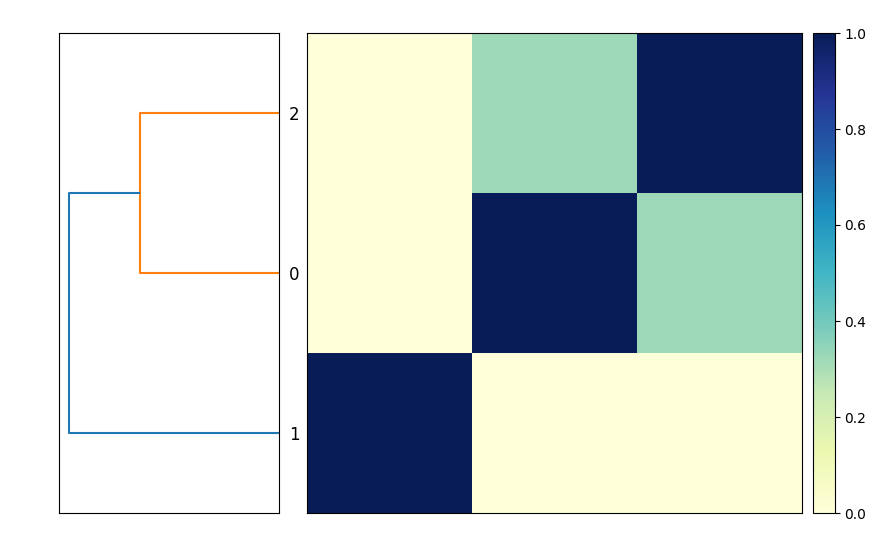

# Chapter 1 - snakemake runs programs for  you!

Bioinformatics often involves running many different programs to characterize and reduce sequencing data, and I use snakemake to help me do that.

### A first, simple snakemake workflow

Here's a simple, useful snakemake workflow:
```python
rule compare_genomes:
    message: "compare all input genomes using sourmash"
    shell: """
        sourmash sketch dna -p k=31 genomes/*.fna.gz --name-from-first 
 
        sourmash compare GCF_000021665.1.fna.gz.sig \
            GCF_000017325.1.fna.gz.sig GCF_000020225.1.fna.gz.sig \
            -o compare.mat
 
        sourmash plot compare.mat
    """
```
Put it in a file called `Snakefile`, and run it with `snakemake -j 1`.

This will produce the output file `compare.mat.matrix.png` which contains a similarity matrix and a dendrogram of the three genomes (see Figure 1).



This is functionally equivalent to putting these three commands into a file `compare-genomes.sh` and running it with `bash compare-genomes.sh` -

```shell
sourmash sketch dna -p k=31 genomes/*.fna.gz --name-from-first 
 
sourmash compare GCF_000021665.1.fna.gz.sig \
            GCF_000017325.1.fna.gz.sig GCF_000020225.1.fna.gz.sig \
            -o compare.mat 
 
sourmash plot compare.mat 
```

The snakemake version is already a little bit nicer because it will
give you encouragement when the commands run successfully (with nice
green text saying "1 of 1 steps (100%) done"!) and if the commands
fail you'll get red text alerting you to that, too.

But! We can further improve the snakemake version over the shell
script version!

### Avoiding unnecessary rerunning of commands: a second snakemake workflow

The commands will run every time you invoke snakemake with `snakemake -j 1`. But most of the time you don't need to rerun them because you've already got the output files you wanted!

How do you get snakemake to avoid rerunning rules?

We can do that by telling snakemake what we expect the output to be by adding an `output:` block in front of the shell block:
```python
rule compare_genomes:
    message: "compare all input genomes using sourmash"
    output:
        "compare.mat.matrix.png"
    shell: """
        sourmash sketch dna -p k=31 genomes/*.fna.gz --name-from-first

        sourmash compare GCF_000021665.1.fna.gz.sig \
            GCF_000017325.1.fna.gz.sig GCF_000020225.1.fna.gz.sig \
            -o compare.mat

        sourmash plot compare.mat
    """

```
and now when we run `snakemake -j 1` once, it will run the commands; but when we run it again, it will say, "Nothing to be done (all requested files are present and up to date)."

This is because the desired output file, `compare.mat.matrix.png`, already exists. So snakemake knows it doesn't need to do anything!

If you remove `compare.mat.matrix.png` and run `snakemake -j 1` again, snakemake will happily make the files again:
```shell
rm compare.mat.matrix.png
snakemake -j 1
```

So snakemake makes it easy to avoid re-running a set of commands if it
has already produced the files you wanted. This is one of the best
reasons to use a workflow system like snakemake for running
bioinformatics workflows; shell scripts don't automatically avoid
re-running commands.

### Running only the commands you need to run

The last Snakefile above has three commands in it, but if you remove the `compare.mat.matrix.png` file you only need to run the last command again - the files created by the first two commands already exist and don't need to be recreated. However, snakemake doesn't know that - it treats the entire rule as one rule, and doesn't look into the shell command to work out what it doesn't need to run.

If we want to avoid re-creating the files that already exist, we need to make the Snakefile a little bit more complicated.

First, let's break out the commands into three separate rules.
```python
rule sketch_genomes:
    shell: """
        sourmash sketch dna -p k=31 genomes/*.fna.gz --name-from-first
    """

rule compare_genomes:
    shell: """
        sourmash compare GCF_000021665.1.fna.gz.sig \
            GCF_000017325.1.fna.gz.sig GCF_000020225.1.fna.gz.sig \
            -o compare.mat
    """

rule plot_comparison:
    message: "compare all input genomes using sourmash"
    output:
        "compare.mat.matrix.png"
    shell: """
        sourmash plot compare.mat
    """
```

We didn't do anything too complicated here - we made two new rule blocks, with their own names, and split the shell commands up so that each shell command has its own rule block.

You can tell snakemake to run all three:
```shell
snakemake -j 1 sketch_genomes compare_genomes plot_comparison
```
and it will successfully run them all!

However, we're back to snakemake running some of the commands every time - it won't run `plot_comparison` every time, because `compare.mat.matrix.png` exists, but it will run `sketch_genomes` and `compare_genomes` repeatedly.

How do we fix this?

### Adding output blocks to each rule

If add output blocks to *each* rule, then snakemake will only run rules
where the output needs to be updated (e.g. because it doesn't exist).

Let's do that:

```python
rule sketch_genomes:
    output:
        "GCF_000017325.1.fna.gz.sig",
        "GCF_000020225.1.fna.gz.sig",
        "GCF_000021665.1.fna.gz.sig"
    shell: """
        sourmash sketch dna -p k=31 genomes/*.fna.gz --name-from-first
    """

rule compare_genomes:
    output:
        "compare.mat"
    shell: """
        sourmash compare GCF_000021665.1.fna.gz.sig \
            GCF_000017325.1.fna.gz.sig GCF_000020225.1.fna.gz.sig \
            -o compare.mat
    """

rule plot_comparison:
    message: "compare all input genomes using sourmash"
    output:
        "compare.mat.matrix.png"
    shell: """
        sourmash plot compare.mat
    """
```
and now
```
snakemake -j 1 sketch_genomes compare_genomes plot_comparison
```
will run each command only once, as long as the output files are still there. Huzzah!

But we still have to specify the names of all three rules, in the right order, to run this. That's annoying! Let's fix that next.
