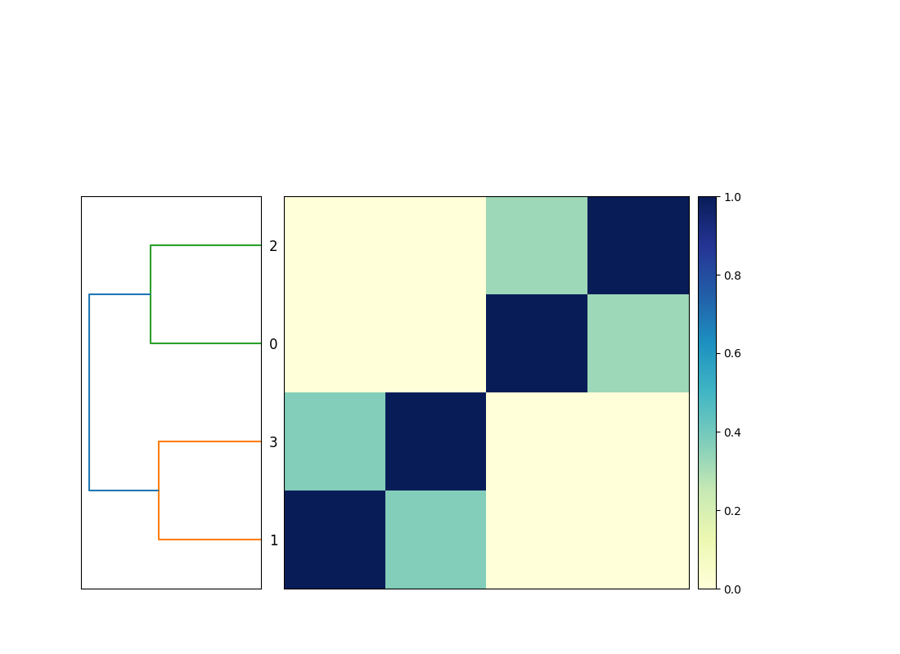

# Chapter 8 - adding new genomes

So we've got a new genome, and we can build a sketch for it. Let's
add it into our comparison, so we're building comparison matrix
for _four_ genomes, and not just three!

To add this new genome in to the comparison, all you need to do is add
the sketch into the `compare_genomes` input, and snakemake will
automatically locate the associated genome file and run
`sketch_genome` on it (as in the previous chapter), and then run
`compare_genomes` on it.  snakemake will take care of the rest!

```python
rule sketch_genome:
    input:
        "genomes/{accession}.fna.gz",
    output:
        "{accession}.fna.gz.sig",
    shell: """
        sourmash sketch dna -p k=31 {input} --name-from-first
    """

rule compare_genomes:
    input:
        "GCF_000017325.1.fna.gz.sig",
        "GCF_000020225.1.fna.gz.sig",
        "GCF_000021665.1.fna.gz.sig",
        "GCF_008423265.1.fna.gz.sig",
    output:
        "compare.mat"
    shell: """
        sourmash compare {input} -o {output}
    """

rule plot_comparison:
    message: "compare all input genomes using sourmash"
    input:
        "compare.mat"
    output:
        "compare.mat.matrix.png"
    shell: """
        sourmash plot {input}
    """
```

Now when you run `snakemake -j 3 plot_comparison` you will get a
`compare.mat.matrix.png` file that contains a 4x4 matrix! (See Figure.)



Note that the workflow diagram has now expanded to include our fourth genome, too!


